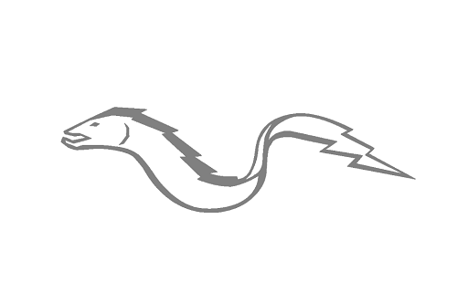
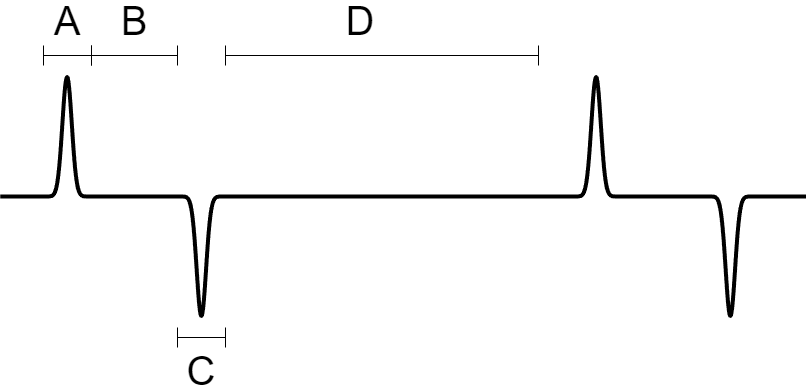



# Setup
-	Baud: 115200
-	Stop bits: 1
-	Parity: None
-	Data bits: 8
-	DAC out pin: PA4 (CN7 $\rightarrow$ right column, 4th from bottom, in line with A2 pin)

# Commands

**ENTER**: toggles bursts (important: no line ending).  
**Parameter adjustment during runtime:**  
Every command consists of **5** ASCII characters.  
The first one specifies the parameter to be set, the next four characters have to be numbers.  
The three numbers after the parameter name are taken as values, and multiplied by ten to the 
power of the last digit.  
Example:
**"A2500"** : sets the A parameter to 250 (microseconds).  
**"N0021"** : sets the N (number of bursts) parameter to 20 ($002 \times 10^1 = 20$).

# Parameters
-	**A**: Length of the first, "upper facing" bell curve in microseconds. Default: 250 µs.
("A2500" or "A0251", same effect)

-	**B**: Length of the gap between the two bell curves in microseconds. Default: 250 µs.
("B2500" or "B0251")

-	**C**: Length of the second, "down facing" bell curve in microseconds. Default: 250 µs.
("C2500" or "C0251")

-	**D**: Length of the gap between two bursts in microseconds. Default: 2.50 ms. 
("D2501" or "D0252")

-	**N**: Number of bursts. Default: 10.
("N0100" or "N0011")

-	**M**: Time between bursts. This number is multiplied by the time of the D parameter, 
resulting in M * D seconds of gap.  
Example: M = 100, D = 2500µs (D_ARR = 3125)  $\rightarrow$ time between bursts becomes 100 * 2500 µs = 250000 µs.  
Default value: M = 50 (125000 µs)
("M0500" or "M0051")

-	**P**: PWM duty cycle. Increments in 1%. Default value: 30%.
("P0300" or "P0031")

-	**S**: SPI data. Default value: 0 (16 bits). Only a single bit can be 1, the rest are 0. 
The input must be between 0-15, this sets the corresponding bit.  
Example: "S0050" $\rightarrow$ data sent: "0b00000000 0b00100000"

-	**V**: Voltage amplitude of bell curves (relative to baseline), in millivolts. Default: 1500 mV.
("V1501" or "V0152")

-	**O**: Offset value of the whole signal, in millivolts. Default: 1550 mV.
("O1551") 

# Command limits
If the first character specified isn't in this list, nothing happens.  
If the data sent doesn't have exactly 5 characters, the device has to be reset, as the UART receiver function waits for exactly 5 bytes.  
-	Parameters **A, B, C, D** should not be under 30, going under that may cause messed up waveforms.
-	**M** can be 0.
-	**P** is between 0 and 100.
-	**S** is between 0 and 15.
-	Setting **N** to 0 causes no bursts, doesn't cause crashes, can be adjusted after.
-	**V** should be set to 1500 mV maximum, if the signal is outside of the DAC's 3.3V limit, it -	gets cut off by the software.
-	**O** can be anywhere between 0V and 3300 mV in theory, however it affects the whole signal, so the bell curves may get clamped. Setting **O** during stimulation is not a good idea!!

